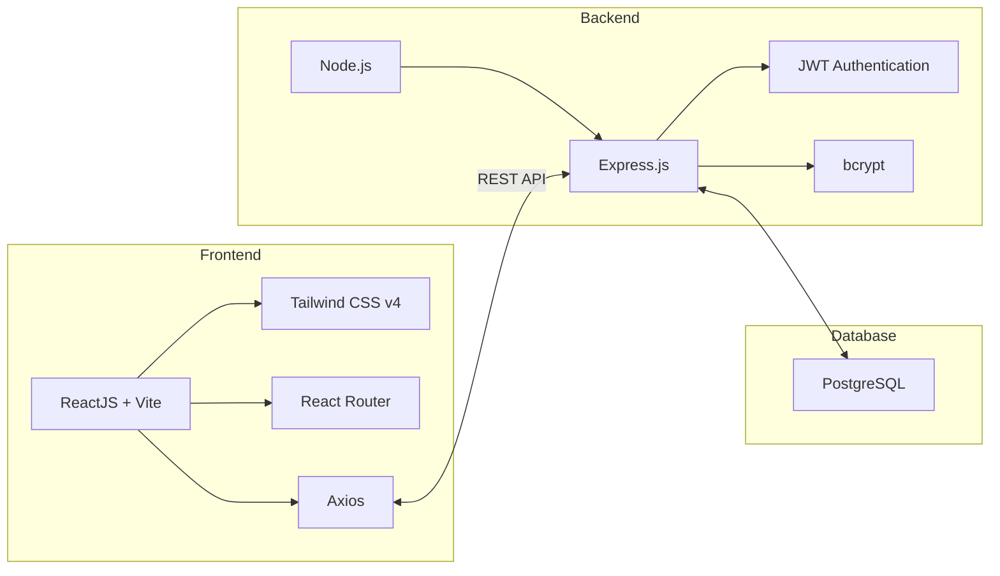
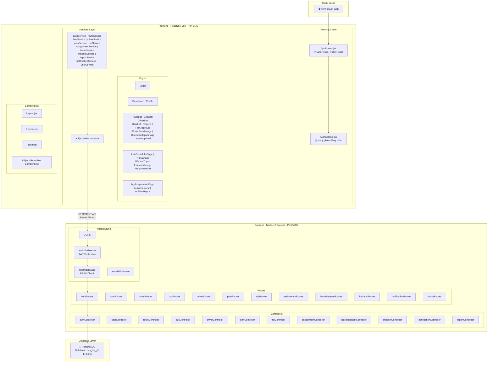
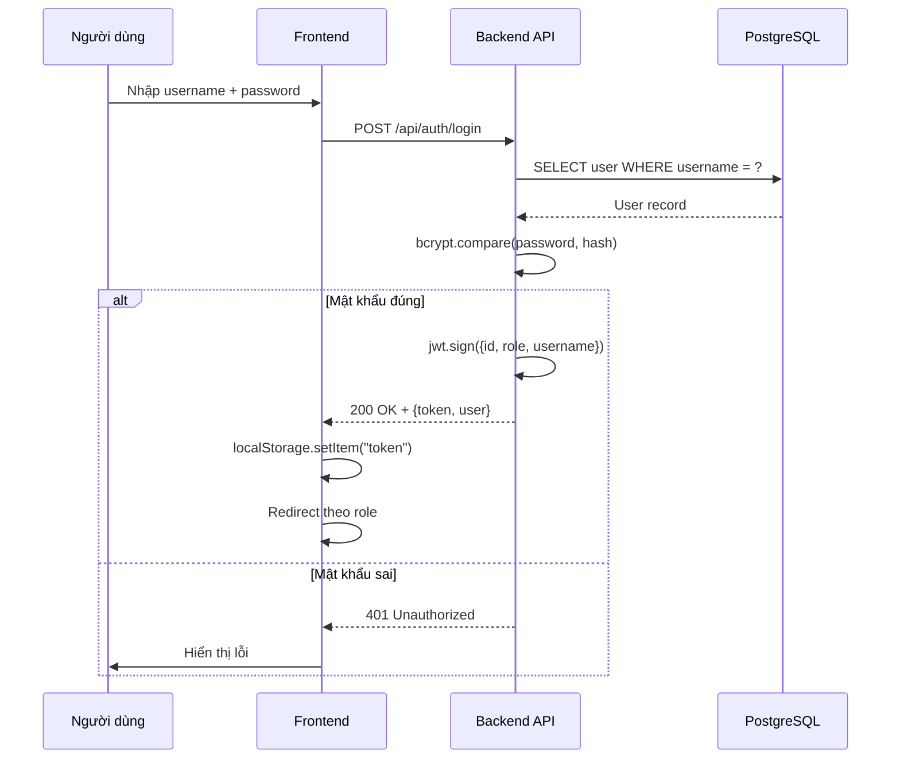
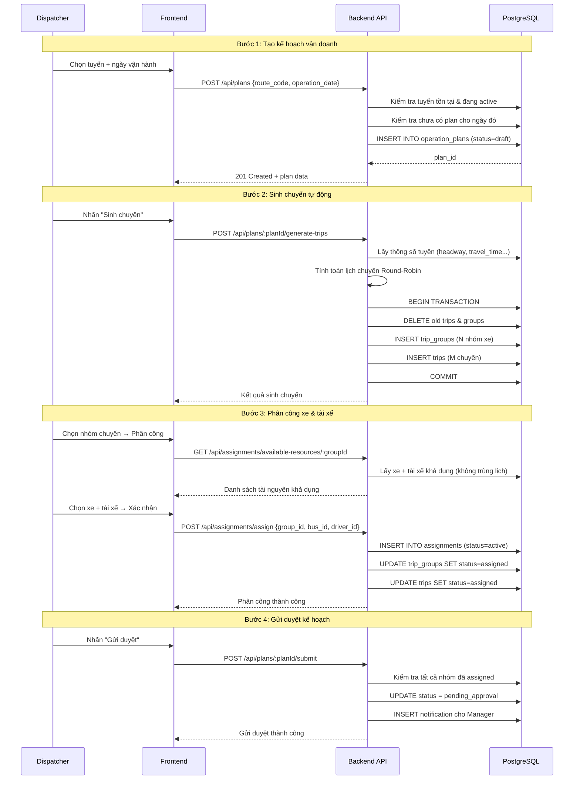
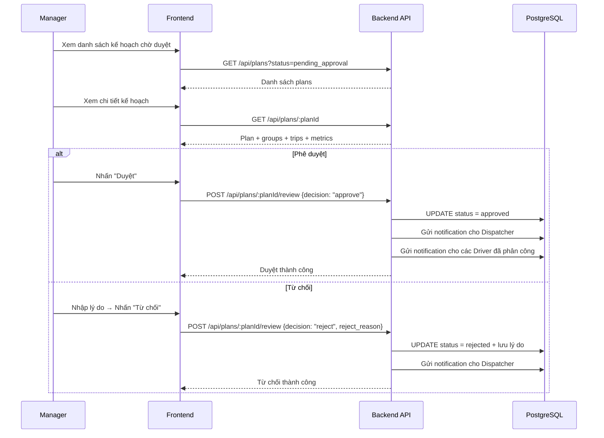
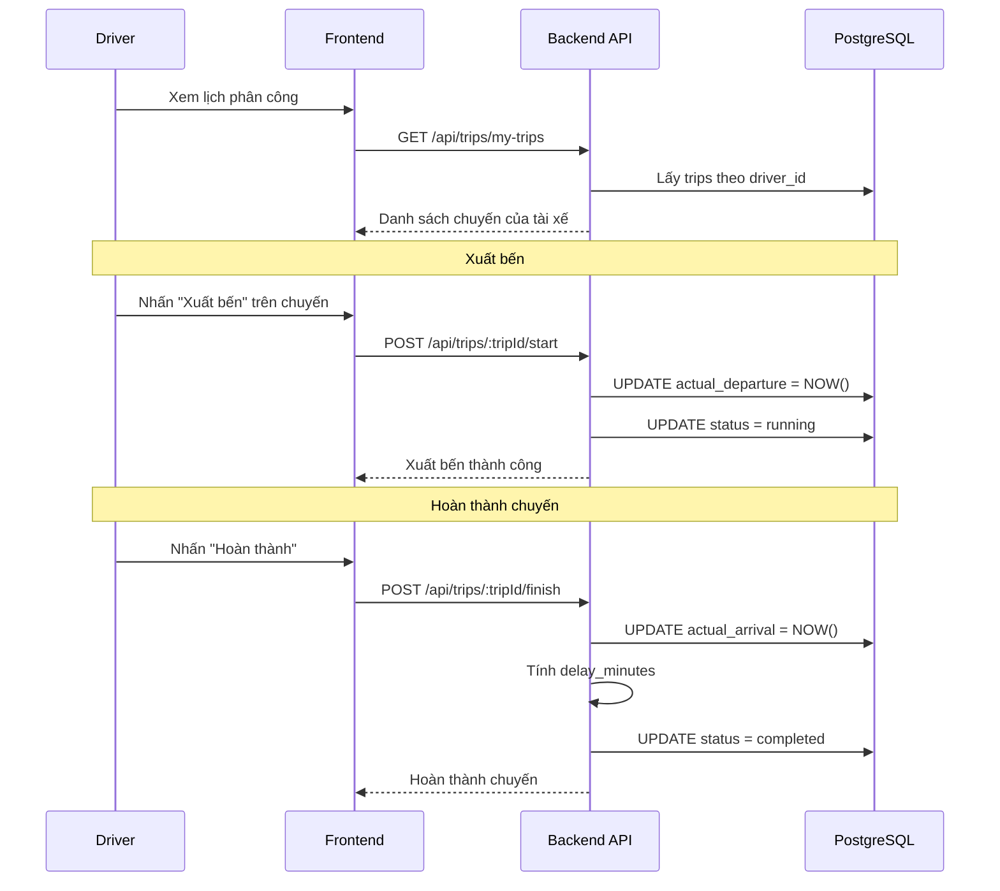
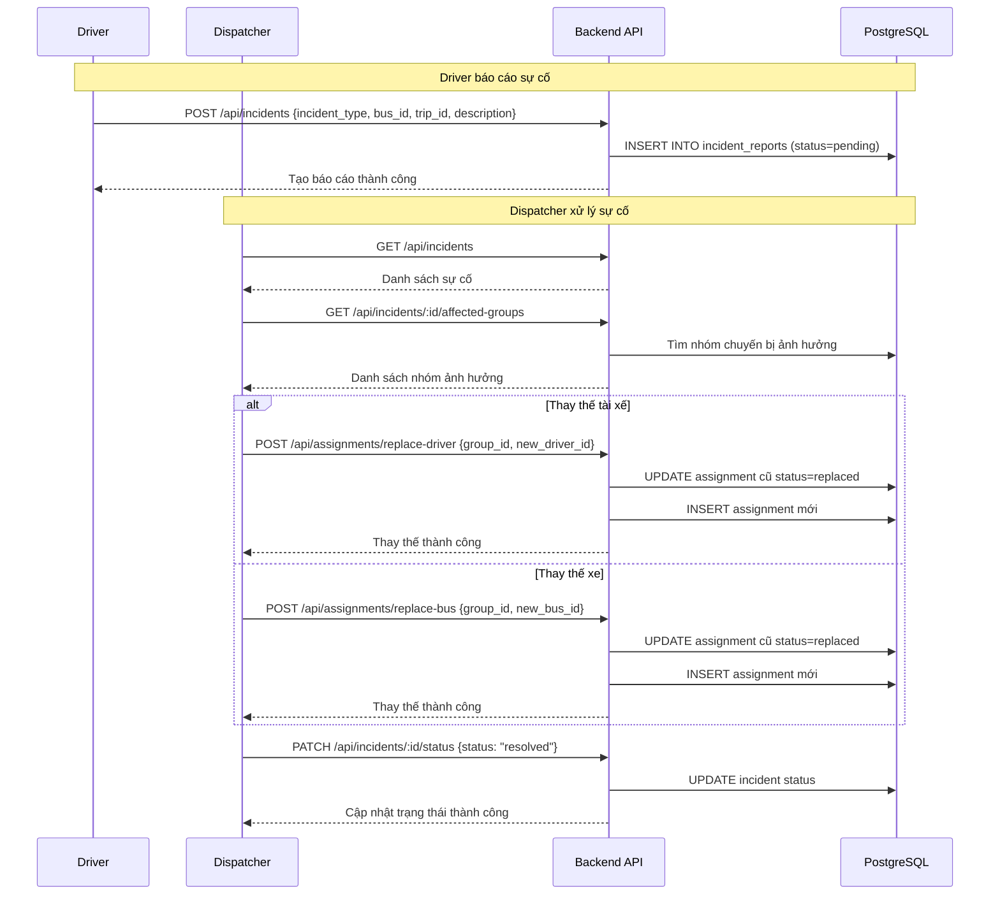
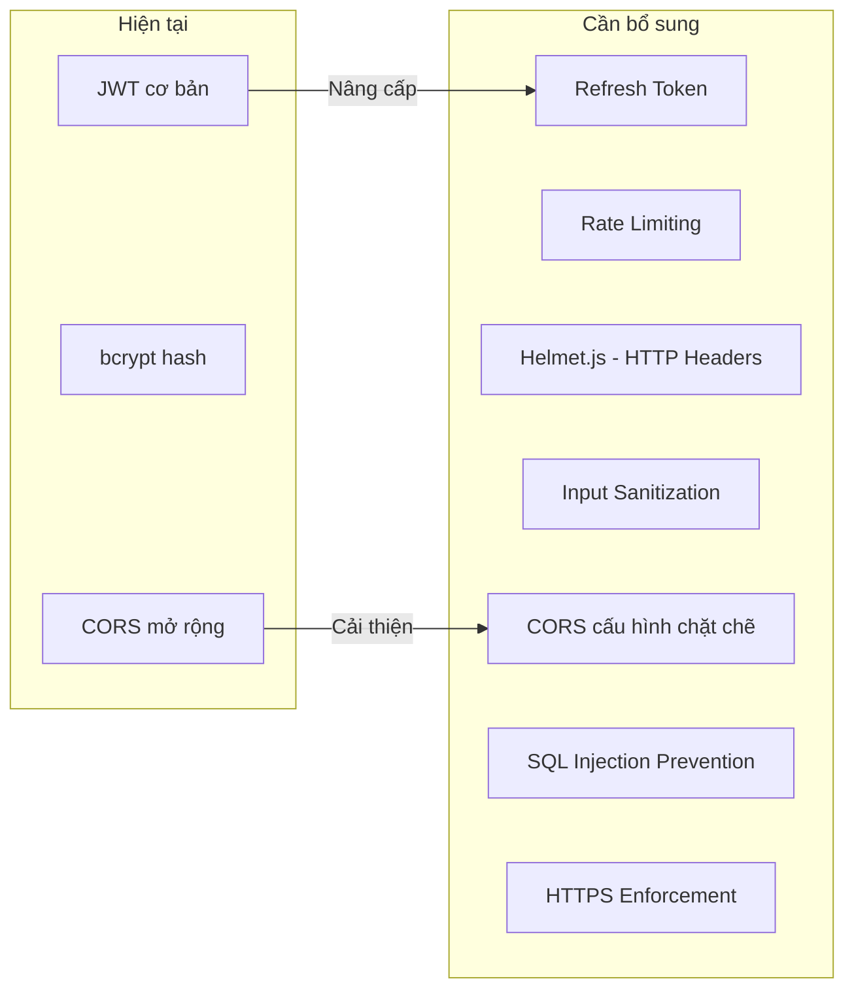
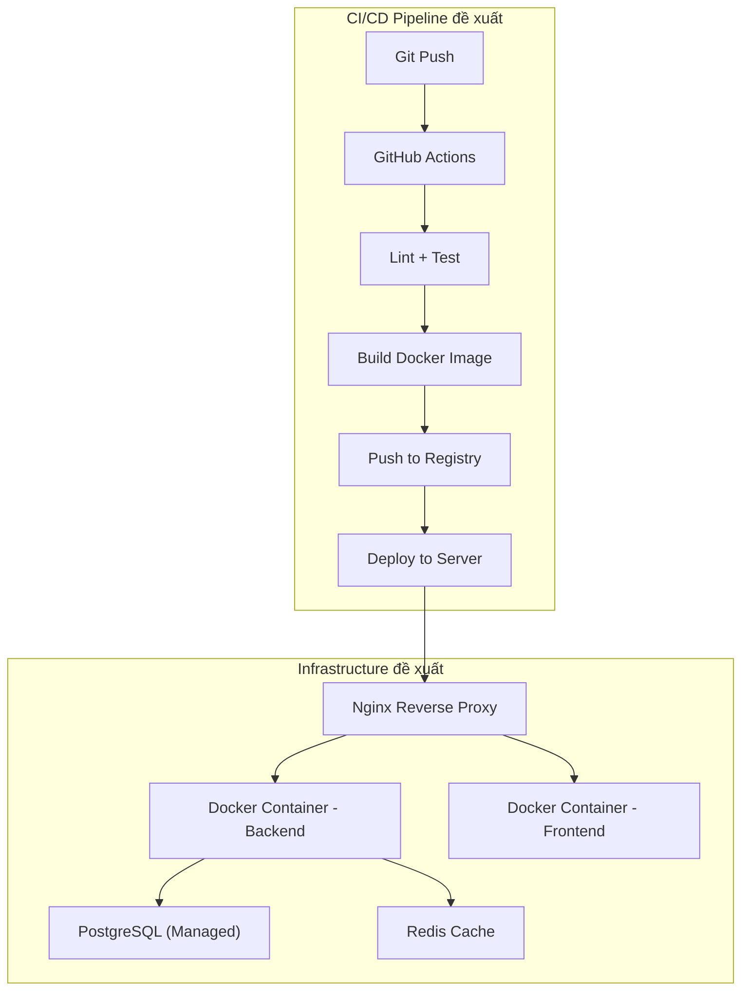

# BÁO CÁO ĐỒ ÁN MÔN HỌC CÔNG NGHỆ PHẦN MỀM

## HỆ THỐNG PHÂN CÔNG CHUYẾN XE BUÝT TP.HCM

---

**Môn học:** Nhập môn Công nghệ Phần mềm  
**Ngày báo cáo:** 03/06/2026

---

## MỤC LỤC

1. [Tổng quan dự án](#1-tổng-quan-dự-án)
2. [Công nghệ sử dụng](#2-công-nghệ-sử-dụng)
3. [Sơ đồ Use Case](#3-sơ-đồ-use-case)
4. [Sơ đồ cơ sở dữ liệu (ER Diagram)](#4-sơ-đồ-cơ-sở-dữ-liệu-er-diagram)
5. [Kiến trúc hệ thống](#5-kiến-trúc-hệ-thống)
6. [Sơ đồ tuần tự (Sequence Diagram)](#6-sơ-đồ-tuần-tự-sequence-diagram)
7. [Danh sách API Endpoints](#7-danh-sách-api-endpoints)
8. [Các chức năng cần phát triển thêm](#8-các-chức-năng-cần-phát-triển-thêm)
9. [Đề xuất tối ưu hệ thống](#9-đề-xuất-tối-ưu-hệ-thống)
10. [Kết luận](#10-kết-luận)

---

## 1. Tổng quan dự án

### 1.1. Giới thiệu

Hệ Thống Phân Công Chuyến Xe Buýt TP.HCM là một ứng dụng web quản lý và phân công chuyến xe buýt, được thiết kế với kiến trúc **Frontend - Backend tách biệt** và hỗ trợ phân quyền theo vai trò (**Role-based Access Control - RBAC**).

### 1.2. Mục tiêu

- Quản lý danh mục tuyến xe, xe buýt, tài xế
- Lập kế hoạch vận doanh tự động (sinh chuyến theo giãn cách khai thác)
- Phân công tài xế và xe buýt cho các nhóm chuyến
- Theo dõi và giám sát thực hiện chuyến xe
- Xử lý sự cố, nghỉ phép và thay thế tài nguyên
- Thống kê báo cáo hiệu suất vận hành

### 1.3. Các vai trò trong hệ thống

| Vai trò | Mô tả | Quyền hạn chính |
|---------|--------|-----------------|
| **Manager** | Quản lý vận hành | Quản lý danh mục (tuyến, xe, tài xế), duyệt kế hoạch, duyệt nghỉ phép, xem báo cáo thống kê |
| **Dispatcher** | Nhân viên điều phối | Lập kế hoạch vận doanh, sinh chuyến, phân công tài xế/xe, xử lý sự cố |
| **Driver** | Tài xế | Xem lịch làm việc, ghi nhận chuyến (xuất bến/hoàn thành), xin nghỉ phép, báo cáo sự cố |

---

## 2. Công nghệ sử dụng

### 2.1. Sơ đồ công nghệ



| Thành phần | Công nghệ | Mô tả |
|-----------|-----------|-------|
| **Frontend** | ReactJS (Vite) | Framework xây dựng giao diện người dùng |
| **CSS** | Tailwind CSS v4 | Framework CSS tiện ích |
| **Routing** | React Router | Điều hướng SPA |
| **HTTP Client** | Axios | Gọi API RESTful |
| **Backend** | Node.js + Express.js | Xây dựng REST API server |
| **Auth** | JWT + bcrypt | Xác thực và mã hóa mật khẩu |
| **Database** | PostgreSQL | Hệ quản trị CSDL quan hệ |

---

## 3. Sơ đồ Use Case

### 3.1. Use Case Diagram tổng quan

```mermaid
graph TB
    subgraph "Hệ thống Phân công Chuyến Xe Buýt"
        UC1["UC01: Đăng nhập"]
        UC2["UC02: Xem Dashboard"]
        UC3["UC03: Quản lý hồ sơ cá nhân"]
        UC4["UC04: Đổi mật khẩu"]
        UC5["UC05: Xem thông báo"]

        subgraph "Manager - Quản lý vận hành"
            UC_M1["UC06: Quản lý tuyến xe"]
            UC_M2["UC07: Quản lý xe buýt"]
            UC_M3["UC08: Quản lý tài xế"]
            UC_M4["UC09: Quản lý tài khoản"]
            UC_M5["UC10: Quản lý hướng tuyến & điểm dừng"]
            UC_M6["UC11: Bố trí xe cho tuyến"]
            UC_M7["UC12: Duyệt kế hoạch vận doanh"]
            UC_M8["UC13: Duyệt nghỉ phép"]
            UC_M9["UC14: Xem báo cáo thống kê"]
        end

        subgraph "Dispatcher - Điều phối viên"
            UC_D1["UC15: Tạo kế hoạch vận doanh"]
            UC_D2["UC16: Sinh chuyến tự động"]
            UC_D3["UC17: Phân công tài xế & xe"]
            UC_D4["UC18: Gửi duyệt kế hoạch"]
            UC_D5["UC19: Quản lý chuyến xe"]
            UC_D6["UC20: Xử lý sự cố"]
            UC_D7["UC21: Thay thế tài xế"]
            UC_D8["UC22: Thay thế xe buýt"]
            UC_D9["UC23: Xem chuyến bị ảnh hưởng"]
        end

        subgraph "Driver - Tài xế"
            UC_DR1["UC24: Xem lịch phân công"]
            UC_DR2["UC25: Xuất bến chuyến xe"]
            UC_DR3["UC26: Hoàn thành chuyến xe"]
            UC_DR4["UC27: Gửi yêu cầu nghỉ phép"]
            UC_DR5["UC28: Báo cáo sự cố"]
        end
    end

    Manager((Manager))
    Dispatcher((Dispatcher))
    Driver((Driver))

    Manager --> UC1
    Manager --> UC2
    Manager --> UC3
    Manager --> UC4
    Manager --> UC5
    Manager --> UC_M1
    Manager --> UC_M2
    Manager --> UC_M3
    Manager --> UC_M4
    Manager --> UC_M5
    Manager --> UC_M6
    Manager --> UC_M7
    Manager --> UC_M8
    Manager --> UC_M9

    Dispatcher --> UC1
    Dispatcher --> UC2
    Dispatcher --> UC3
    Dispatcher --> UC4
    Dispatcher --> UC5
    Dispatcher --> UC_D1
    Dispatcher --> UC_D2
    Dispatcher --> UC_D3
    Dispatcher --> UC_D4
    Dispatcher --> UC_D5
    Dispatcher --> UC_D6
    Dispatcher --> UC_D7
    Dispatcher --> UC_D8
    Dispatcher --> UC_D9

    Driver --> UC1
    Driver --> UC2
    Driver --> UC3
    Driver --> UC4
    Driver --> UC5
    Driver --> UC_DR1
    Driver --> UC_DR2
    Driver --> UC_DR3
    Driver --> UC_DR4
    Driver --> UC_DR5
```



### 3.2. Đặc tả Use Case chi tiết

#### UC01: Đăng nhập hệ thống

| Thuộc tính | Mô tả |
|-----------|-------|
| **Actor** | Manager, Dispatcher, Driver |
| **Mô tả** | Người dùng đăng nhập vào hệ thống bằng tài khoản |
| **Tiền điều kiện** | Có tài khoản hợp lệ trong hệ thống |
| **Luồng chính** | 1. Nhập username + password → 2. Hệ thống xác thực → 3. Trả JWT Token → 4. Chuyển hướng theo vai trò |
| **Luồng thay thế** | Sai mật khẩu → Thông báo lỗi |
| **Kết quả** | Đăng nhập thành công, lưu token vào localStorage |

#### UC15: Tạo kế hoạch vận doanh

| Thuộc tính | Mô tả |
|-----------|-------|
| **Actor** | Dispatcher |
| **Mô tả** | Tạo kế hoạch vận doanh cho tuyến xe trong ngày cụ thể |
| **Tiền điều kiện** | Tuyến xe đang hoạt động, chưa có kế hoạch cho ngày đó |
| **Luồng chính** | 1. Chọn tuyến xe → 2. Chọn ngày → 3. Tạo kế hoạch (draft) → 4. Sinh chuyến tự động → 5. Phân công xe & tài xế → 6. Gửi duyệt |
| **Ràng buộc** | Tuyến phải có đủ hướng đi/về, giãn cách khai thác hợp lệ |
| **Kết quả** | Kế hoạch được tạo ở trạng thái `draft` |

#### UC16: Sinh chuyến tự động

| Thuộc tính | Mô tả |
|-----------|-------|
| **Actor** | Dispatcher |
| **Mô tả** | Hệ thống tự động sinh danh sách chuyến xe dựa trên thông số tuyến |
| **Tiền điều kiện** | Kế hoạch ở trạng thái `draft` |
| **Thuật toán** | Tính số cặp lượt xuất bến = ⌊(Thời gian hoạt động / Giãn cách) + 1⌋, phân bổ Round-Robin vào nhóm xe |
| **Kết quả** | Tạo trip_groups + trips cho kế hoạch |

#### UC25: Xuất bến chuyến xe

| Thuộc tính | Mô tả |
|-----------|-------|
| **Actor** | Driver |
| **Mô tả** | Tài xế bắt đầu chuyến xe, ghi nhận thời gian xuất bến thực tế |
| **Tiền điều kiện** | Chuyến xe ở trạng thái `assigned`, thuộc phân công của tài xế |
| **Luồng chính** | 1. Chọn chuyến xe → 2. Nhấn "Xuất bến" → 3. Cập nhật `actual_departure`, trạng thái = `running` |
| **Kết quả** | Chuyến xe chuyển sang trạng thái `running` |

---

## 4. Sơ đồ cơ sở dữ liệu (ER Diagram)

### 4.1. Entity Relationship Diagram

```mermaid
erDiagram
    users {
        SERIAL user_id PK
        VARCHAR username UK
        VARCHAR password_hash
        VARCHAR full_name
        VARCHAR role "manager | dispatcher | driver"
        VARCHAR status "active | locked"
    }

    routes {
        VARCHAR route_code PK "VD: 01, 08"
        VARCHAR route_name
        VARCHAR status "active | inactive"
        TIME start_time
        TIME end_time
        INT expected_trips_per_day
        NUMERIC headway_minutes
        INT confirmed_operating_buses
    }

    route_directions {
        SERIAL direction_id PK
        VARCHAR route_code FK
        VARCHAR direction_type "outbound | inbound"
        VARCHAR start_point
        VARCHAR end_point
        NUMERIC distance_km
        INT travel_time_minutes
        INT turnaround_time_minutes
    }

    bus_stops {
        SERIAL stop_id PK
        INT direction_id FK
        INT stop_order
        VARCHAR stop_name
        INT minute_from_start
    }

    buses {
        SERIAL bus_id PK
        VARCHAR license_plate UK
        INT seat_count
        VARCHAR status "active | broken | inactive"
    }

    drivers {
        SERIAL driver_id PK
        INT user_id FK_UK
        VARCHAR full_name
        VARCHAR phone
        VARCHAR license_class
        VARCHAR status "working | on_leave | inactive"
    }

    route_buses {
        SERIAL route_bus_id PK
        VARCHAR route_code FK
        INT bus_id FK
        VARCHAR bus_role "operating | standby"
    }

    operation_plans {
        SERIAL plan_id PK
        VARCHAR route_code FK
        DATE operation_date
        INT created_by FK
        VARCHAR status "draft | pending_approval | approved | rejected"
        INT submitted_by FK
        INT reviewed_by FK
        TEXT reject_reason
    }

    trip_groups {
        SERIAL group_id PK
        INT plan_id FK
        VARCHAR group_name
        TIMESTAMP start_time
        TIMESTAMP end_time
        VARCHAR status "unassigned | assigned"
    }

    trips {
        SERIAL trip_id PK
        INT plan_id FK
        INT direction_id FK
        INT group_id FK
        INT trip_order
        TIMESTAMP scheduled_departure
        TIMESTAMP scheduled_arrival
        TIMESTAMP actual_departure
        TIMESTAMP actual_arrival
        INT delay_minutes
        VARCHAR status "scheduled | assigned | running | completed | cancelled"
    }

    assignments {
        SERIAL assignment_id PK
        INT group_id FK
        INT bus_id FK
        INT driver_id FK
        INT assigned_by FK
        VARCHAR status "active | replaced | cancelled"
    }

    leave_requests {
        SERIAL leave_id PK
        INT driver_id FK
        DATE leave_date
        TEXT reason
        VARCHAR status "pending | approved | rejected"
        INT reviewed_by FK
    }

    incident_reports {
        SERIAL incident_id PK
        INT reported_by FK
        INT bus_id FK
        INT trip_id FK
        VARCHAR incident_type "bus_broken | delay | cancelled | other"
        TEXT description
        VARCHAR status "pending | processing | resolved"
    }

    notifications {
        SERIAL notification_id PK
        INT user_id FK
        VARCHAR title
        TEXT content
        BOOLEAN is_read
        TIMESTAMP created_at
    }

    users ||--o{ drivers : "1 user = 1 driver"
    routes ||--|{ route_directions : "has"
    route_directions ||--o{ bus_stops : "has"
    routes ||--o{ route_buses : "has"
    buses ||--o{ route_buses : "assigned_to"
    routes ||--o{ operation_plans : "has"
    users ||--o{ operation_plans : "created_by"
    operation_plans ||--o{ trip_groups : "has"
    operation_plans ||--o{ trips : "has"
    trip_groups ||--o{ trips : "contains"
    trip_groups ||--o{ assignments : "has"
    buses ||--o{ assignments : "assigned"
    drivers ||--o{ assignments : "assigned"
    users ||--o{ assignments : "assigned_by"
    drivers ||--o{ leave_requests : "requests"
    users ||--o{ incident_reports : "reports"
    buses ||--o{ incident_reports : "involved_in"
    trips ||--o{ incident_reports : "related_to"
    users ||--o{ notifications : "receives"
    route_directions ||--o{ trips : "direction"
```

### 4.2. Bảng tổng hợp CSDL

| STT | Tên bảng | Số cột | Mô tả |
|-----|----------|--------|-------|
| 1 | `users` | 6 | Tài khoản đăng nhập và vai trò |
| 2 | `routes` | 8 | Thông tin tuyến xe buýt |
| 3 | `route_directions` | 8 | Hướng tuyến (lượt đi/về) |
| 4 | `bus_stops` | 5 | Điểm dừng trên tuyến |
| 5 | `buses` | 4 | Thông tin xe buýt |
| 6 | `drivers` | 6 | Thông tin tài xế |
| 7 | `route_buses` | 4 | Bố trí xe vận doanh/dự phòng cho tuyến |
| 8 | `operation_plans` | 8 | Kế hoạch vận doanh theo ngày |
| 9 | `trip_groups` | 5 | Nhóm chuyến xoay vòng |
| 10 | `trips` | 11 | Danh sách chuyến xe |
| 11 | `assignments` | 5 | Phân công xe & tài xế cho nhóm chuyến |
| 12 | `leave_requests` | 6 | Yêu cầu nghỉ phép |
| 13 | `incident_reports` | 7 | Báo cáo sự cố |
| 14 | `notifications` | 6 | Thông báo nội bộ |

### 4.3. Indexes & Constraints đặc biệt

| Index/Constraint | Bảng | Mô tả |
|-----------------|------|-------|
| `uq_group_active_assignment` | assignments | Partial Unique Index - đảm bảo mỗi nhóm chuyến chỉ có 1 phân công active |
| `uq_route_date` | operation_plans | Unique - mỗi tuyến chỉ có 1 kế hoạch/ngày |
| `uq_route_direction` | route_directions | Unique - mỗi tuyến chỉ có 1 lượt đi & 1 lượt về |
| `idx_notifications_user_unread` | notifications | Partial Index - tối ưu truy vấn thông báo chưa đọc |

---

## 5. Kiến trúc hệ thống

### 5.1. Sơ đồ kiến trúc tổng quan



### 5.2. Luồng xác thực (Authentication Flow)



### 5.3. Cấu trúc thư mục dự án

```
NPCNPM/
├── backend/
│   ├── src/
│   │   ├── config/           # Cấu hình kết nối Database
│   │   ├── controllers/      # 12 controllers xử lý nghiệp vụ
│   │   ├── middlewares/       # auth, role, error middleware
│   │   ├── routes/            # 12 route modules
│   │   ├── utils/             # Helper functions
│   │   ├── app.js             # Express configuration
│   │   └── server.js          # HTTP server entry point
│   ├── .env.example
│   └── package.json
├── frontend/
│   ├── src/
│   │   ├── components/        # Layout, Sidebar, Topbar, UI
│   │   ├── context/           # AuthContext (state management)
│   │   ├── pages/             # 5 nhóm: auth, shared, manager, dispatcher, driver
│   │   ├── routes/            # AppRoutes (PrivateRoute, PublicRoute)
│   │   ├── services/          # 15 API service modules
│   │   ├── App.jsx            # Root component + Routing
│   │   └── main.jsx           # Entry point
│   └── package.json
├── database/
│   ├── schema.sql             # 14 bảng
│   ├── constraints.sql        # FK + CHECK constraints
│   ├── indexes.sql            # Performance indexes
│   └── seed.sql               # Dữ liệu mẫu
└── documents/                 # Tài liệu thiết kế (6 file .docx)
```

---

## 6. Sơ đồ tuần tự (Sequence Diagram)

### 6.1. Luồng lập kế hoạch vận doanh



### 6.2. Luồng duyệt kế hoạch



### 6.3. Luồng thực hiện chuyến xe (Driver)



### 6.4. Luồng xử lý sự cố



---

## 7. Danh sách API Endpoints

### 7.1. Authentication & Users

| Method | Endpoint | Role | Mô tả |
|--------|----------|------|-------|
| `POST` | `/api/auth/login` | Public | Đăng nhập |
| `GET` | `/api/auth/me` | All | Lấy thông tin user hiện tại |
| `GET` | `/api/users` | Manager | Lấy danh sách users |
| `POST` | `/api/users` | Manager | Tạo tài khoản mới |
| `PUT` | `/api/users/:userId` | Manager | Cập nhật tài khoản |
| `PATCH` | `/api/users/:userId/status` | Manager | Khóa/mở tài khoản |
| `PUT` | `/api/users/profile` | All | Cập nhật hồ sơ cá nhân |
| `PUT` | `/api/users/profile/password` | All | Đổi mật khẩu |

### 7.2. Routes & Directions

| Method | Endpoint | Role | Mô tả |
|--------|----------|------|-------|
| `GET` | `/api/routes` | All (auth) | Lấy danh sách tuyến xe |
| `GET` | `/api/routes/:routeCode` | All (auth) | Chi tiết tuyến xe |
| `POST` | `/api/routes` | Manager | Tạo tuyến mới |
| `PUT` | `/api/routes/:routeCode` | Manager | Cập nhật tuyến |
| `PATCH` | `/api/routes/:routeCode/status` | Manager | Đổi trạng thái tuyến |
| `GET` | `/api/routes/:routeCode/directions` | All (auth) | Hướng tuyến |
| `POST` | `/api/routes/:routeCode/directions` | Manager | Tạo hướng tuyến |
| `PUT` | `/api/routes/:routeCode/directions/:id` | Manager | Sửa hướng tuyến |
| `GET` | `/api/routes/directions/:id/stops` | All (auth) | Điểm dừng theo hướng |
| `POST` | `/api/routes/stops` | Manager, Dispatcher | Thêm điểm dừng |
| `PUT` | `/api/routes/stops/:stopId` | Manager, Dispatcher | Sửa điểm dừng |
| `DELETE` | `/api/routes/stops/:stopId` | Manager, Dispatcher | Xóa điểm dừng |
| `GET` | `/api/routes/:routeCode/buses` | All (auth) | Xe bố trí cho tuyến |
| `POST` | `/api/routes/:routeCode/buses` | Manager | Thêm xe vào tuyến |
| `DELETE` | `/api/routes/:routeCode/buses/:busId` | Manager | Gỡ xe khỏi tuyến |

### 7.3. Buses & Drivers

| Method | Endpoint | Role | Mô tả |
|--------|----------|------|-------|
| `GET` | `/api/buses` | All (auth) | Danh sách xe buýt |
| `GET` | `/api/buses/:busId` | All (auth) | Chi tiết xe |
| `POST` | `/api/buses` | Manager | Thêm xe mới |
| `PUT` | `/api/buses/:busId` | Manager | Cập nhật xe |
| `PATCH` | `/api/buses/:busId/status` | Manager | Đổi trạng thái xe |
| `GET` | `/api/drivers` | All (auth) | Danh sách tài xế |
| `GET` | `/api/drivers/:driverId` | All (auth) | Chi tiết tài xế |
| `POST` | `/api/drivers` | Manager | Thêm tài xế mới |
| `PUT` | `/api/drivers/:driverId` | Manager | Cập nhật tài xế |
| `PATCH` | `/api/drivers/:driverId/status` | Manager | Đổi trạng thái tài xế |

### 7.4. Plans & Trips

| Method | Endpoint | Role | Mô tả |
|--------|----------|------|-------|
| `GET` | `/api/plans` | All (auth) | Danh sách kế hoạch |
| `GET` | `/api/plans/:planId` | All (auth) | Chi tiết kế hoạch (+ groups, trips, metrics) |
| `POST` | `/api/plans` | Dispatcher | Tạo kế hoạch |
| `POST` | `/api/plans/:planId/generate-trips` | Dispatcher | Sinh chuyến tự động |
| `POST` | `/api/plans/:planId/submit` | Dispatcher | Gửi duyệt |
| `POST` | `/api/plans/:planId/review` | Manager | Duyệt/từ chối |
| `GET` | `/api/trips` | All (auth) | Danh sách chuyến |
| `GET` | `/api/trips/my-trips` | Driver | Chuyến của tài xế |
| `GET` | `/api/trips/:tripId` | All (auth) | Chi tiết chuyến |
| `POST` | `/api/trips/:tripId/start` | Driver | Xuất bến |
| `POST` | `/api/trips/:tripId/finish` | Driver | Hoàn thành |
| `POST` | `/api/trips/:tripId/cancel` | Dispatcher | Hủy chuyến |

### 7.5. Assignments, Leave & Incidents

| Method | Endpoint | Role | Mô tả |
|--------|----------|------|-------|
| `GET` | `/api/assignments` | All (auth) | Danh sách phân công |
| `POST` | `/api/assignments/assign` | Dispatcher | Phân công nhóm chuyến |
| `POST` | `/api/assignments/replace-driver` | Dispatcher | Thay thế tài xế |
| `POST` | `/api/assignments/replace-bus` | Dispatcher | Thay thế xe |
| `GET` | `/api/assignments/available-resources/:groupId` | Dispatcher | Tài nguyên khả dụng |
| `GET` | `/api/leave-requests` | Manager, Dispatcher | Danh sách nghỉ phép |
| `GET` | `/api/leave-requests/my` | Driver | Nghỉ phép của tôi |
| `POST` | `/api/leave-requests` | Driver | Gửi yêu cầu nghỉ |
| `POST` | `/api/leave-requests/:id/review` | Manager | Duyệt nghỉ phép |
| `GET` | `/api/leave-requests/:id/affected-groups` | Manager, Dispatcher | Nhóm bị ảnh hưởng |
| `GET` | `/api/incidents` | Manager, Dispatcher | Danh sách sự cố |
| `GET` | `/api/incidents/my` | Driver | Sự cố của tôi |
| `POST` | `/api/incidents` | Driver | Báo cáo sự cố |
| `PATCH` | `/api/incidents/:id/status` | Dispatcher | Cập nhật trạng thái sự cố |
| `GET` | `/api/incidents/:id/affected-groups` | Dispatcher | Nhóm bị ảnh hưởng |

### 7.6. Notifications & Reports

| Method | Endpoint | Role | Mô tả |
|--------|----------|------|-------|
| `GET` | `/api/notifications/my` | All (auth) | Thông báo của tôi |
| `PATCH` | `/api/notifications/:id/read` | All (auth) | Đánh dấu đã đọc |
| `POST` | `/api/notifications/read-all` | All (auth) | Đánh dấu tất cả đã đọc |
| `GET` | `/api/reports/routes` | Manager | Thống kê theo tuyến |
| `GET` | `/api/reports/buses` | Manager | Thống kê theo xe |
| `GET` | `/api/reports/drivers` | Manager | Thống kê theo tài xế |

---

## 8. Các chức năng cần phát triển thêm

### 8.1. Chức năng ưu tiên cao 🔴

| STT | Chức năng | Mô tả | Lý do |
|-----|-----------|-------|-------|
| 1 | **Theo dõi GPS thời gian thực** | Tích hợp bản đồ hiển thị vị trí xe buýt đang chạy trên tuyến | Cốt lõi vận hành - giúp dispatcher giám sát và phản ứng nhanh với sự cố |
| 2 | **Thông báo thời gian thực (WebSocket)** | Push notification qua WebSocket thay vì polling API | Hiện tại notification chỉ cập nhật khi reload trang |
| 3 | **Phân công tự động (Auto-assign)** | Thuật toán tự động phân công tài xế + xe dựa trên lịch sử, kinh nghiệm, tình trạng | Giảm thao tác thủ công cho dispatcher, tối ưu phân bổ tài nguyên |
| 4 | **Refresh Token & Session Management** | Implement refresh token, tự động gia hạn phiên | Bảo mật - hiện JWT hết hạn phải login lại |
| 5 | **Quản lý lịch sử chỉnh sửa (Audit Log)** | Ghi nhận lịch sử thay đổi dữ liệu quan trọng | Truy vết ai sửa gì, khi nào - phục vụ kiểm toán |

### 8.2. Chức năng ưu tiên trung bình 🟡

| STT | Chức năng | Mô tả | Lý do |
|-----|-----------|-------|-------|
| 6 | **Dashboard thống kê nâng cao** | Biểu đồ tương tác (Chart.js/Recharts), bộ lọc theo khoảng thời gian | Dashboard hiện tại còn đơn giản |
| 7 | **Xuất báo cáo PDF/Excel** | Xuất báo cáo dưới dạng file PDF hoặc Excel | Phục vụ in ấn, lưu trữ ngoại tuyến |
| 8 | **Quản lý ca làm việc** | Phân chia ca sáng/chiều/tối cho tài xế, giới hạn giờ lái | Tuân thủ quy định lao động |
| 9 | **Hệ thống cảnh báo tự động** | Cảnh báo khi xe quá hạn bảo dưỡng, tài xế quá giờ lái | Phòng ngừa rủi ro vận hành |
| 10 | **Tích hợp API bên thứ 3** | Kết nối với hệ thống thẻ xe buýt, camera giám sát | Mở rộng tính năng |
| 11 | **Quản lý lịch bảo dưỡng xe** | Lập lịch bảo dưỡng, theo dõi số km đã chạy | Kéo dài tuổi thọ xe, đảm bảo an toàn |

### 8.3. Chức năng ưu tiên thấp 🟢

| STT | Chức năng | Mô tả | Lý do |
|-----|-----------|-------|-------|
| 12 | **Ứng dụng Mobile cho tài xế** | App React Native/Flutter cho driver | Thao tác nhanh trên điện thoại khi lái xe |
| 13 | **Hệ thống chat nội bộ** | Kênh liên lạc giữa dispatcher ↔ driver | Hỗ trợ xử lý sự cố nhanh |
| 14 | **Đa ngôn ngữ (i18n)** | Hỗ trợ tiếng Anh ngoài tiếng Việt | Mở rộng đối tượng sử dụng |
| 15 | **Dark mode** | Chế độ tối cho giao diện | Trải nghiệm người dùng |
| 16 | **Hành khách tra cứu tuyến** | Portal công khai cho hành khách xem lịch trình | Giá trị gia tăng |

---

## 9. Đề xuất tối ưu hệ thống

### 9.1. Tối ưu Backend

#### 9.1.1. Kiến trúc & Code Pattern

| Vấn đề hiện tại | Đề xuất tối ưu | Chi tiết |
|-----------------|----------------|---------|
| Controller chứa cả business logic & DB query | **Tách Service Layer** | Tạo `services/` layer tách biệt logic nghiệp vụ khỏi controller. Controller chỉ nhận request, gọi service, trả response |
| SQL queries inline trong controller | **Repository Pattern** hoặc **ORM** | Sử dụng Sequelize/Prisma ORM hoặc tạo `repositories/` cho các truy vấn DB |
| Thiếu input validation | **Middleware Validation** | Sử dụng `Joi` hoặc `express-validator` để validate request body/params |
| Thiếu rate limiting | **Rate Limiter** | Sử dụng `express-rate-limit` chống brute-force và DDoS |
| Logging đơn giản (console.log) | **Structured Logging** | Sử dụng `Winston` hoặc `Pino` với log levels, file rotation |

#### 9.1.2. Bảo mật



| Hạng mục | Hiện trạng | Đề xuất |
|----------|-----------|---------|
| JWT Secret | Hardcoded fallback `'supersecretkey123'` | Dùng biến môi trường, rotatable secret |
| CORS | `cors()` mở toàn bộ origin | Cấu hình whitelist origin cụ thể |
| HTTP Headers | Chưa có | Thêm `helmet.js` bảo vệ XSS, clickjacking |
| SQL Injection | Đã sử dụng parameterized query ($1, $2...) ✅ | Giữ nguyên, bổ sung input sanitization |
| Password Policy | Chưa có quy tắc mật khẩu | Enforce ≥ 8 ký tự, chữ hoa, số, đặc biệt |

### 9.2. Tối ưu Frontend

| Vấn đề | Đề xuất | Benefit |
|--------|---------|---------|
| Không có state management toàn cục cho data | **React Query (TanStack Query)** | Cache API data, auto refetch, giảm network requests |
| Không có loading skeleton | **Skeleton UI** | UX mượt mà hơn khi load dữ liệu |
| Không có error boundary | **React Error Boundary** | Catch render errors, hiển thị fallback UI |
| Tailwind CSS v4 chưa tối ưu bundle | **PurgeCSS** / cấu hình content paths | Giảm CSS bundle size |
| Component không lazy load | **React.lazy + Suspense** | Code splitting, giảm initial bundle size |

### 9.3. Tối ưu Database

#### 9.3.1. Indexes bổ sung

```sql
-- Index composite cho truy vấn trips theo ngày và trạng thái
CREATE INDEX idx_trips_date_status 
ON trips (scheduled_departure, status);

-- Index cho báo cáo performance
CREATE INDEX idx_trips_actual_times 
ON trips (actual_departure, actual_arrival) 
WHERE actual_departure IS NOT NULL;

-- Index cho operation_plans theo status
CREATE INDEX idx_plans_status 
ON operation_plans (status, operation_date);

-- Index cho leave_requests theo status + date
CREATE INDEX idx_leave_status_date 
ON leave_requests (status, leave_date);
```

#### 9.3.2. Cải thiện Schema

| Đề xuất | Chi tiết |
|---------|---------|
| Thêm `created_at`, `updated_at` | Cho tất cả bảng - phục vụ audit trail |
| Thêm bảng `audit_logs` | Ghi nhận thay đổi: who, what, when, old_value, new_value |
| Thêm bảng `schedules` | Quản lý ca làm việc tài xế |
| Soft Delete | Thêm `deleted_at` thay vì xóa cứng cho routes, buses, drivers |
| Connection Pooling | Cấu hình pool size phù hợp với tải |

### 9.4. Tối ưu DevOps & Deployment



| Hạng mục | Đề xuất |
|----------|---------|
| **Containerization** | Docker + Docker Compose cho môi trường đồng nhất |
| **CI/CD** | GitHub Actions: lint, test, build, deploy tự động |
| **Caching** | Redis cache cho session, notification count, danh sách tuyến |
| **Reverse Proxy** | Nginx cho static files, SSL termination, load balancing |
| **Monitoring** | PM2 (process manager) + Grafana/Prometheus |
| **Backup** | pg_dump tự động hàng ngày, lưu trữ off-site |

### 9.5. Tối ưu Performance tổng thể

| Kỹ thuật | Mô tả | Áp dụng cho |
|----------|-------|-------------|
| **Pagination** | Phân trang server-side cho danh sách lớn | trips, assignments, notifications |
| **Database Connection Pooling** | Pool size tối ưu theo concurrent users | Backend config |
| **API Response Caching** | Cache response cho dữ liệu ít thay đổi | routes, buses, drivers list |
| **Compression** | Gzip/Brotli cho API response | Express middleware |
| **CDN** | Serve static assets qua CDN | Frontend build files |
| **Lazy Loading** | Load pages/components theo nhu cầu | React.lazy() |
| **Database Query Optimization** | EXPLAIN ANALYZE cho slow queries, tối ưu JOIN | Report queries |
| **WebSocket** | Realtime updates thay vì polling | Notifications, live tracking |

---

## 10. Kết luận

### 10.1. Tổng kết

Hệ thống Phân Công Chuyến Xe Buýt TP.HCM đã được xây dựng với các thành tựu chính:

- ✅ **14 bảng CSDL** được thiết kế chặt chẽ với đầy đủ khóa ngoại, ràng buộc CHECK, Partial Unique Index
- ✅ **12 modules API** (48+ endpoints) RESTful với phân quyền RBAC
- ✅ **3 vai trò** (Manager, Dispatcher, Driver) với giao diện và quyền hạn riêng biệt
- ✅ **Thuật toán sinh chuyến tự động** dựa trên giãn cách khai thác và phân bổ Round-Robin
- ✅ **Quy trình duyệt kế hoạch** hoàn chỉnh (draft → pending_approval → approved/rejected)
- ✅ **Hệ thống thông báo nội bộ** tự động tạo khi có sự kiện
- ✅ **Báo cáo thống kê KPI** theo tuyến, xe, tài xế

### 10.2. Hạn chế

- Chưa có tracking GPS thời gian thực
- Thông báo chưa push realtime (phải refresh trang)
- Phân công tài xế/xe còn thủ công
- Chưa có unit test và integration test
- Chưa dockerize và thiếu CI/CD pipeline

### 10.3. Hướng phát triển

Dựa trên phân tích tại [Mục 8](#8-các-chức-năng-cần-phát-triển-thêm) và [Mục 9](#9-đề-xuất-tối-ưu-hệ-thống), hệ thống có thể phát triển theo các giai đoạn:

1. **Phase 1 (1-2 tháng):** Tối ưu bảo mật, thêm validation, WebSocket notification
2. **Phase 2 (2-3 tháng):** Auto-assign, Dashboard nâng cao, Export PDF/Excel
3. **Phase 3 (3-6 tháng):** GPS tracking, Mobile app, CI/CD deployment

---

> **Ghi chú:** Báo cáo được tạo tự động dựa trên phân tích mã nguồn thực tế của dự án.
